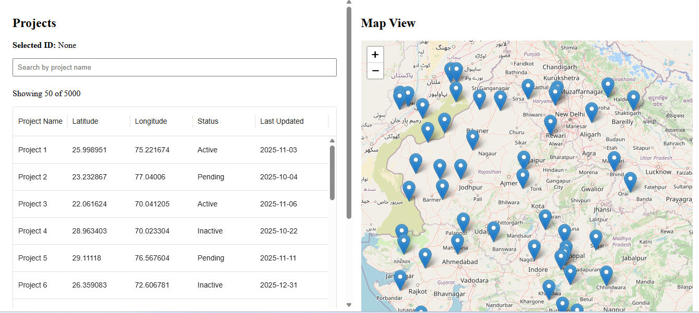
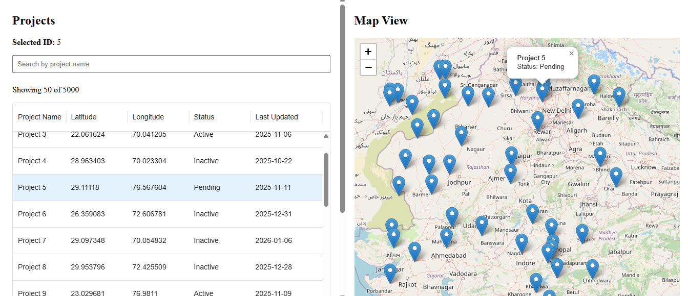
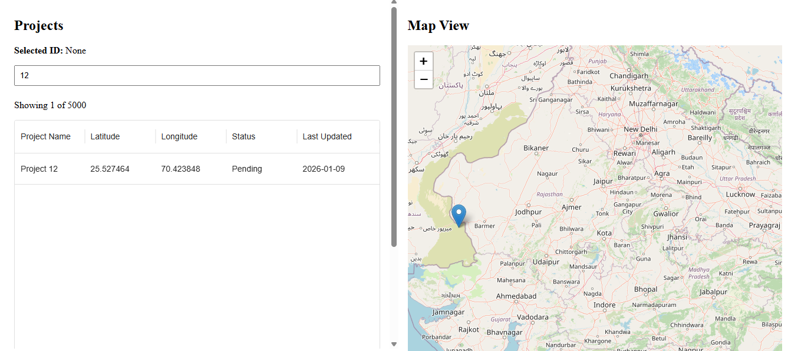

# Geo Data Dashboard (Interview Assignment)

## Screenshots

### Dashboard Overview

### Row & Marker Selection Sync

### Client-side Filtering

## Objective
A React-based dashboard to visualize spatial and tabular project data with map integration.

## Tech Stack
- React (Vite)
- MUI + MUI DataGrid
- Leaflet / react-leaflet
- Local state with hooks

## Features
- Paginated data loading from mock API
- Virtualized data table handling 5k+ rows
- Sorting and client-side filtering
- Interactive map with markers
- Two-way sync between table and map selection

## Architecture Decisions
- State is lifted to the Dashboard component to act as a single source of truth.
- Data fetching logic is isolated in a custom hook.
- UI components (Table, Map) are kept presentational.

## Performance Considerations
- MUI DataGrid provides built-in row virtualization.
- Only visible rows are rendered to the DOM.
- Filtering is memoized at render-level.

## Map & Table Synchronization
- Shared `selectedId` state.
- Table row click updates map.
- Marker click updates table selection.

## Time Spent

**Total: ~6 hours**

## Notes
This project was built solely for evaluation purposes using mock data.
